# crud

[English](README.md) | 机翻中文

Crud 是一个帮助编写增查改删（CRUD）服务的 golang 模块。有了这个东西，你只需要定义模型，其余的 CRUD 代码全都是自动为你完成的。

> crud = [GORM](https://github.com/go-gorm/gorm) +
> [Gin](https://github.com/gin-gonic/gin) +
> [Logrus](https://github.com/sirupsen/logrus) +
> [Viper](https://github.com/spf13/viper) + 
> 自动的 CRUD 服务

## 开始吧

0. 安装:

```sh
go get -u github.com/cdfmlr/crud
```

1. 然后你只需要定义模型，并在 orm 和 router 中注册它们:

```go
package main

import (
	"github.com/cdfmlr/crud/orm"
	"github.com/cdfmlr/crud/router"
)

type Todo struct {
	orm.BasicModel
	Title  string `json:"title"`
	Detail string `json:"detail"`
	Done   bool   `json:"done"`
}

type Project struct {
	orm.BasicModel
	Title string  `json:"title"`
	Todos []*Todo `json:"todos" gorm:"many2many:project_todos"`
}

func main() {
	orm.ConnectDB(orm.DBDriverSqlite, "todolist.db")
	orm.RegisterModel(Todo{}, Project{})

	r := router.NewRouter()
	router.Crud[Todo](r, "/todos")
	router.Crud[Project](r, "/projects",
		router.CrudNested[Project, Todo]("todos"),
	)

	r.Run(":8086")
}
```

这 32 行代码使其成为具有 13 个端点的可用 RESTful API 服务：

```sh
# api to todos
GET    /todos
GET    /todos/:TodoID
POST   /todos
PUT    /todos/:TodoID
DELETE /todos/:TodoID

# api to projects
GET    /projects
GET    /projects/:ProjectID
POST   /projects
PUT    /projects/:ProjectID
DELETE /projects/:ProjectID

# api to nested todos in a project
GET    /projects/:ProjectID/todos
POST   /projects/:ProjectID/todos
DELETE /projects/:ProjectID/todos/:TodoID
```

让我们解释一下。

### orm

`crud/orm` 是一个 ORM 包，可以作为 crud 的 DAO 层。它是对 GORM 的包装，负责数据库连接和自动迁移。

`orm.ConnectDB` 用于连接到数据库.。这是个 `gorm.Open` 的包装。 `orm.RegisterModel` 用于注册您的模型，即调用  `gorm.AutoMigrate` 来构建/更新数据库表。

`orm`包也定义了一个`Model`接口。crud 只能自动为实现了这个接口的模型生成 CRUD 服务。
`orm.BasicModel` 是这个接口的一个基本实现。它是 `gorm.Model` 的一个封装，它定义了一个自动递增的主键和软删除支持。

```go
type BasicModel struct {
    ID        uint `gorm:"primary_key"`
    CreatedAt time.Time
    UpdatedAt time.Time
    DeletedAt *time.Time `sql:"index"`
}
```

在大多数情况下，您只需将 `orm.BasicModel` 嵌入到您的模型中。这是一个很好的起点。

### router

`crud/router` 是一个帮助您基于杜松子酒（Gin）生成 CRUD 服务的软件包。

它提供了一个 `router.NewRouter()` 函数用于创建新的 gin 路由。

神奇的是 `router.Crud[Todo](r, "/todos")`，这将自动为模型 `Todo` 创建一组 REST API 到相对路径 `/todos` 下。

```sh
GET /todos            # get todos list

GET /todos/:id        # get a todo by id

POST /todos           # create a new todo record
{
    "title": "clean my room"
}

PUT /todos/:id        # update a todo record
{
    "done": true
}

DELETE /todos/:id     # delete a todo record
```

注意，类型参数`Todo`是必须的，这对编译器来说是无法推断的。

`router.CrudNested[Project, Todo]("todos")`将为模型 `Project` 中的子模型 `Todo` 创建嵌套的 API，即为 `Project.Todos` 字段提供 CRUD 服务。

```sh
GET    /projects/:ProjectID/todos          # get associated todos list

POST   /projects/:ProjectID/todos          # create new associated relationship
{
    "title": "clean my kitchen"
    "detail": "rm -rf bin; mv cooktop/* cupboard"
}

DELETE /projects/:ProjectID/todos/:TodoID  # delete an associated relationship
```

## 接下来的步骤

对于一个极其简单的项目，比如上面的todolist，直接使用 `crud/orm`和`crud/router` 的顶层就足以使 API 工作完成。但是对于一个更真实的案例，你可以使用 `crud` 的低级部分来建立你自己的 CRUD API 服务。

- `crud/controller`: 包控制器实现了基于模型的通用CRUD 控制器（即http处理程序）来处理创建/读取/更新/删除 的请求。
- `crud/service`: 包服务实现了模型的基本CRUD操作。
- `crud/config` 是 [viper](https://github.com/spf13/viper) 的包装，用来读取结构化化配置。
- `crud/log` 是 [logrus](https://github.com/sirupsen/logrus) 的包装，提供日志功能。

**文档**:

- [go doc](https://pkg.go.dev/github.com/cdfmlr/crud)

**实例**:

- [sshman](https://github.com/cdfmlr/sshman) 是一个更真实的例子，说明crud如何帮助你快速、轻松地建立一个真实世界的 CRUD REST API 项目。请务必看一下。

## 它是如何工作的

crud 的实现是受分层 MVC 架构的启发：



| 层（包）   | Description                         |
| ---------- | ----------------------------------- |
| router     | 定义REST APIs                       |
| controller | 处理HTTP请求（GET/POST/PUT/DELETE） |
| service    | 业务逻辑（创建/读取/更新/删除）     |
| orm        | DAO：对数据库的读写                 |

每一层都是一个包。通过Go中的泛型和反射，crud实现了每一层的通用实现。

## TODOs

- [ ] 自动化测试
- [x] 自动更新依赖的Gin/GORM/...包（dependabot）
- [ ] ...

## MIT License

Copyright (c) 2022 CDFMLR
