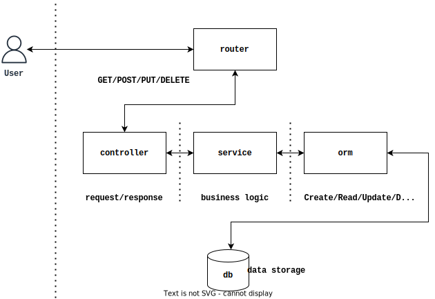

# crud

English | [机翻中文](README-zh_CN.md)

[](https://pkg.go.dev/github.com/cdfmlr/crud) [](https://goreportcard.com/report/github.com/cdfmlr/crud)

Crud is a golang package that helps writing CRUD servers.
With this package, all you need is models,
while all the rest is done for you automatically.

> crud = [GORM](https://github.com/go-gorm/gorm) +
> [Gin](https://github.com/gin-gonic/gin) +
> [Logrus](https://github.com/sirupsen/logrus) +
> [Viper](https://github.com/spf13/viper) + 
> automatic CRUD service

## Get started

0. get the package:

```sh
go get -u github.com/cdfmlr/crud
```

1. all you need are models, and register them in orm & router:

```go
package main

import (
	"github.com/cdfmlr/crud/orm"
	"github.com/cdfmlr/crud/router"
)

type Todo struct {
	orm.BasicModel
	Title  string `json:"title"`
	Detail string `json:"detail"`
	Done   bool   `json:"done"`
}

type Project struct {
	orm.BasicModel
	Title string  `json:"title"`
	Todos []*Todo `json:"todos" gorm:"many2many:project_todos"`
}

func main() {
	orm.ConnectDB(orm.DBDriverSqlite, "todolist.db")
	orm.RegisterModel(Todo{}, Project{})

	r := router.NewRouter()
	router.Crud[Todo](r, "/todos")
	router.Crud[Project](r, "/projects",
		router.CrudNested[Project, Todo]("todos"),
	)

	r.Run(":8086")
}
```

These 32 lines of code make it an available RESTful API service with 13
endpoints:

```sh
# api to todos
GET    /todos
GET    /todos/:TodoID
POST   /todos
PUT    /todos/:TodoID
DELETE /todos/:TodoID

# api to projects
GET    /projects
GET    /projects/:ProjectID
POST   /projects
PUT    /projects/:ProjectID
DELETE /projects/:ProjectID

# api to nested todos in a project
GET    /projects/:ProjectID/todos
POST   /projects/:ProjectID/todos
DELETE /projects/:ProjectID/todos/:TodoID
```

Let's explain it.

### orm

`crud/orm` is an ORM package works as crud's DAO layer. It's a wrapper of GORM
with responsibility for database connection and auto migrate.

`orm.ConnectDB` is used to connect to a database. It's a wrapper of `gorm.Open`.
And `orm.RegisterModel` is used to register your models, which
calls `gorm.AutoMigrate` to build the tables.

`orm` package also defines a `Model` interface. Crud can only automatically
generate CRUD services for models that implement this interface.
`orm.BasicModel` is a basic implementation of this interface. It's a wrapper
of `gorm.Model`, which defines an auto-incrementing primary key and soft delete
support:

```go
type BasicModel struct {
    ID        uint `gorm:"primary_key"`
    CreatedAt time.Time
    UpdatedAt time.Time
    DeletedAt *time.Time `sql:"index"`
}
```

In most cases, you can just embed `orm.BasicModel` to your model. It's a good
starting point.

### router

`crud/router` is a package that helps you to generate CRUD services based on
gin.

It provides a `router.NewRouter()` function to create a new gin router.

And the magic is `router.Crud[Todo](r, "/todos")`, that will automatically make
REST APIs to the model `Todo` at relative path `/todos`:

```sh
GET /todos            # get todos list

GET /todos/:id        # get a todo by id

POST /todos           # create a new todo record
{
    "title": "clean my room"
}

PUT /todos/:id        # update a todo record
{
    "done": true
}

DELETE /todos/:id     # delete a todo record
```

BTW, the type parameter `Todo` is required. It's not inferable for the compiler.

`router.CrudNested[Project, Todo]("todos")` will create nested APIs to the
model `Todo` in the model `Project`, that is, CRUD for the `Project.Todos`
field:

```sh
GET    /projects/:ProjectID/todos          # get associated todos list

POST   /projects/:ProjectID/todos          # create new associated relationship
{
    "title": "clean my kitchen"
    "detail": "rm -rf bin; mv cooktop/* cupboard"
}

DELETE /projects/:ProjectID/todos/:TodoID  # delete an associated relationship
```

## Next steps

For an extremely simple project, like todolist above, using `crud/orm`
and `crud/router` together is enough to make API jobs done.
But for a more real-world case, you may want to use lower level parts of `crud`
to build your own CRUD API services:

- `crud/controller`: Package controller implements model based generic CRUD
  controllers (i.e. http handlers) to handle create / read / update / delete
  requests from http clients.
- `crud/service`: Package service implements the basic CRUD operations for
  models.
- `crud/config` is a package that helps you to read configuration into a
  structure based "ConfigModel". It's a wrapper
  of [viper](https://github.com/spf13/viper)
- `crud/log` is a package that helps you to log your application. It's a wrapper
  of [logrus](https://github.com/sirupsen/logrus)

**Documents**:

- [go doc](https://pkg.go.dev/github.com/cdfmlr/crud)

**Examples**:

- [sshman](https://github.com/cdfmlr/sshman) is a more real world example of how
  crud can help you build a CRUD REST API project fast and easily. Please check
  it out.

## How it works

The implementation of crud is inspired by the layered MVC architecture:



| Layer      | Description                                     |
|------------|-------------------------------------------------|
| router     | define REST APIs                                |
| controller | handles the HTTP requests (GET/POST/PUT/DELETE) |
| service    | business logic (Create/Read/Update/Delete)      |
| orm        | DAO: R/Ws to the database                       |

Each layer is a package. And with generics and reflection in Go,
crud achieves generic implementations for each layer.

## TODOs

- [ ] tests for services and controllers
- [x] updates depended Gin/GORM/... packages automaticly (dependabot)
- [ ] ...

## MIT License

Copyright (c) 2022 CDFMLR
